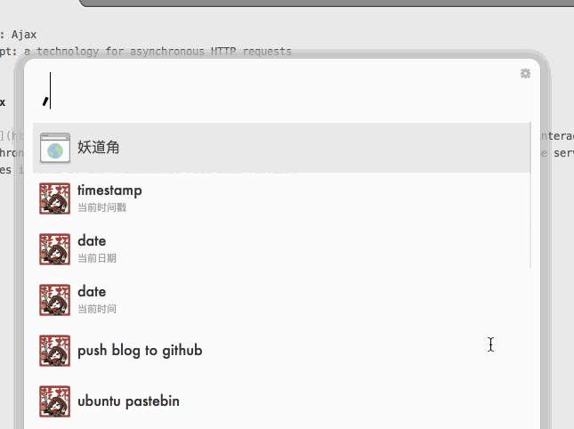

An alfred workflow for [Simplified JavaScript Jargon](https://github.com/HugoGiraudel/SJSJ)
====

> Simplified JavaScript Jargon in Terminal

Content from [HugoGiraudel/SJSJ](https://github.com/HugoGiraudel/SJSJ).

Note: I write this workflow using **aflred v3.0** and **node v6.0.0**. It may have problems with other versions.

### Pre-requisites

1. Node
2. Clone *SJSJ* to `~/.SJSJ` : `git clone https://github.com/HugoGiraudel/SJSJ ~/.SJSJ`

### Usage

1. [Download]()
2. Run alfred, type `,ab` to list what's in [abbr.yml](https://github.com/HugoGiraudel/SJSJ/blob/gh-pages/_data/abbr.yml) 
3. Run alfred, type `,gl` to list what's in [glossary](https://github.com/HugoGiraudel/SJSJ/tree/gh-pages/_glossary) and press `Enter` to see details
4. Run alfred , type `,ab ajax` or `,gl ajax` to search for a specific keyword
